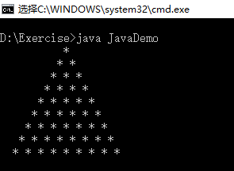

# 循环嵌套
1. 以下是循环嵌套实现乘法口诀表
```
public class JavaDemo
{
	public static void main(String[] args)
	{
		for(int i = 1; i<=9; i++)
		{
			for(int j =1; j<=i; j++)
			{
				System.out.print(j + "*" + i + "=" + (i*j) + "\t");
			}
			System.out.println(); // 换行
		}
	}
}

```
2.以下是循环嵌套实现打印三角形

```
public class JavaDemo
{
	public static void main(String[] args)
	{
		int line = 9; // 设置行数
		for(int i = 0; i<line; i++)
		{
			for(int j =0; j<=line -i ; j++)
			{
				System.out.print(" ");
			}
			for(int k = 0; k<=i ; k++)
			{
				System.out.print("* "); 
			}
			
			System.out.println(); // 换行
		}
	}
}

```

