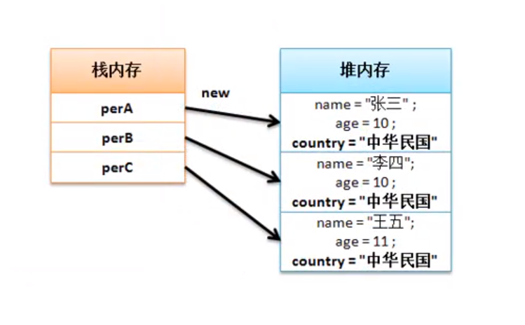
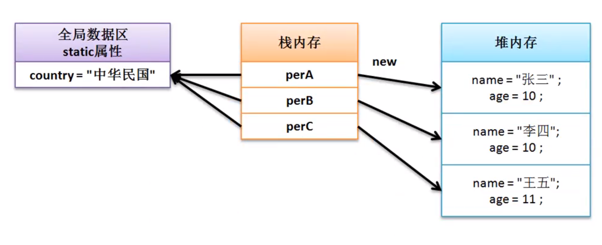

# 声明static属性
1. 简单分析以下代码，发现若要修改所有人员为统一的一个国家，必须把每一个对象的国家属性设置。
2. 公共属性的情景就可以使用static关键字。
3. static属性可以不用进行对象实例化，就可调用，类名.属性名。
```
class Person
{
	private String name;
	private int age;
	private String country; // 国家

	public String getInfo()
	{
		return "【人员信息】\n" +"姓名：" + this.name +"、年龄：" + age + "、国家：" + this.country;
	}

	public Person(String name , int age , String country)
	{
		this.name = name ;
		this.age    = age ;
		this.country = country ;
	}
	
}
public class JavaDemo 
{
	public static void main (String [] args)
	{
		Person person1 = new Person("张三",12,"中华民国");
		Person person2 = new Person("张三",12,"中华民国");
		Person person3 = new Person("张三",12,"中华民国");

		System.out.println(person1.getInfo()); 
		System.out.println(person2.getInfo());
		System.out.println(person3.getInfo());
	}
}
```


---

以下是使用static属性范例，由于方便，在这对country不进行封装。

```
class Person
{
	private String name;
	private int age;
	static String country; // 国家

	public String getInfo()
	{
		return "【人员信息】\n" +"姓名：" + this.name +"、年龄：" + age + "、国家：" + this.country;
	}

	public Person(String name , int age )
	{
		this.name = name ;
		this.age  = age ;
	}
	
}
public class JavaDemo 
{
	public static void main (String [] args)
	{
		Person person1 = new Person("张三",12);
		Person person2 = new Person("张三",12);
		Person person3 = new Person("张三",12);
		Person.country = "中华人民共和国"; // static属性调用  类名.属性名 

		System.out.println(person1.getInfo()); 
		System.out.println(person2.getInfo());
		System.out.println(person3.getInfo());
	}
}
```

