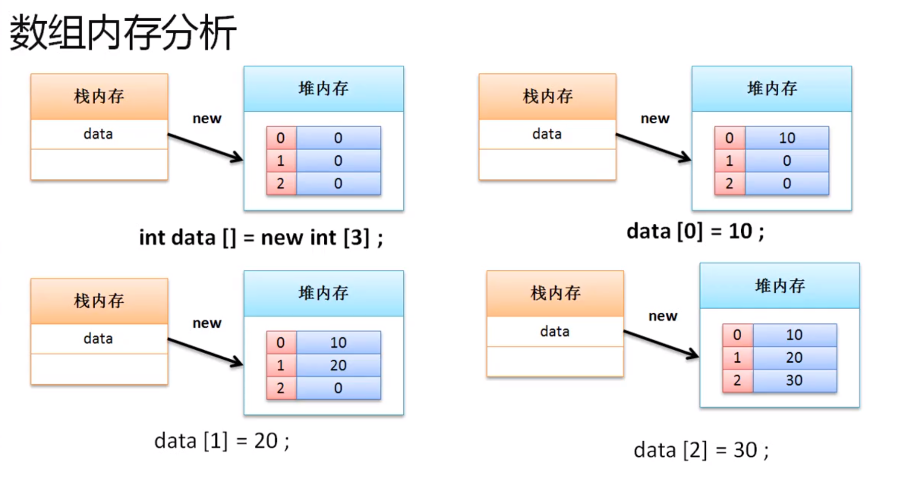
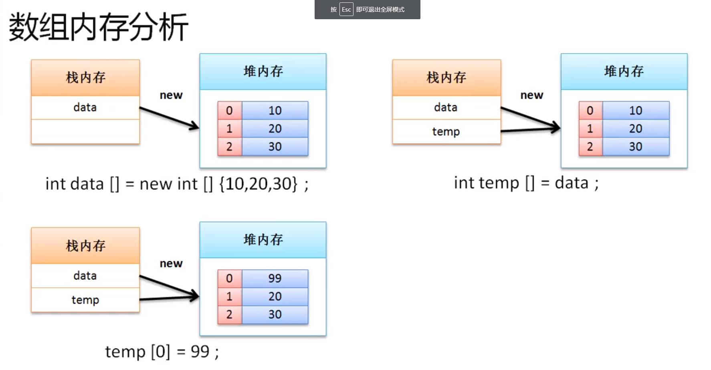

# 数组引用传递分析
1. 以下是数组的内存分析：
```
public class JavaDemo 
{
	public static void main (String [] args)
	{
		int [] data = new int [3] ; // 动态初始化

		data[0] = 10 ;
		data[1] = 20 ;
		data[2] = 30 ;

		for(int i = 0 ; i< data.length; i++)
		{
			System.out.println(data[i]) ; // 10 20 30
		}
	}
}
```



```
public class JavaDemo 
{
	public static void main (String [] args)
	{
		int [] data = new int []  {10 ,20 ,30} // 静态初始化
		
		int [] temp = data ; // 引用传递

		temp[0] = 99 ;

		for(int i = 0 ; i< data.length; i++)
		{
			System.out.println(data[i]) ; // 99 20 30
		}
	}
}
```

    
