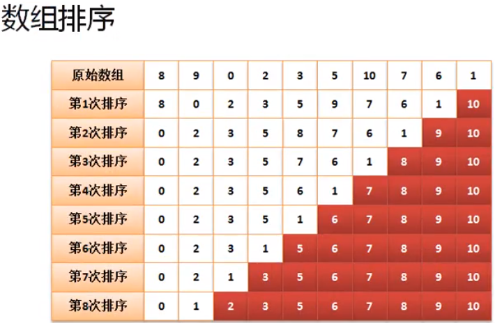

# 数组排序案例分析1
1. 以下是写在主方法的排序原理：


```
public class JavaDemo
{
	public static void main (String[] args)
	{
		int[] data = new int[] {8,9,0,2,3,5,10,7,6,1} ; 
		int temp = 0 ;

		for(int j =0; j<data.length -1 ;j++)
		{
			for(int i =0;i <data.length -j -1;i++)
			{
				if(data[i]>data[i+1])
				{
					temp = data[i] ;
					data[i] = data[i+1];
					data[i+1] = temp ;
				}
			}
		}
		
		printlnArray(data); // 0 1 2 3 5 6 7 8 9 10
	}

	public static void printlnArray (int[] array)
	{
		for(int item:array)
		{
			System.out.println(item);
		}
	}
}
```

2. 面向对象设计使用：

```
class ArrayUtil
{
	public static void sort (int[] data)
	{
		int temp = 0 ;

		for(int j =0; j<data.length -1 ;j++)
		{
			for(int i =0;i <data.length -j -1;i++)
			{
				if(data[i]>data[i+1])
				{
					temp = data[i] ;
					data[i] = data[i+1];
					data[i+1] = temp ;
				}
			}
		}		
	}

	public static void printlnArray (int[] array)
	{
		for(int item:array)
		{
			System.out.println(item);
		}
	}
}

public class JavaDemo
{
	public static void main (String[] args)
	{
		int[] data = new int[] {8,9,0,2,3,5,10,7,6,1} ; 

		ArrayUtil.sort(data);
		ArrayUtil.printlnArray(data); // 0 1 2 3 5 6 7 8 9 10
	}

	
}
```

