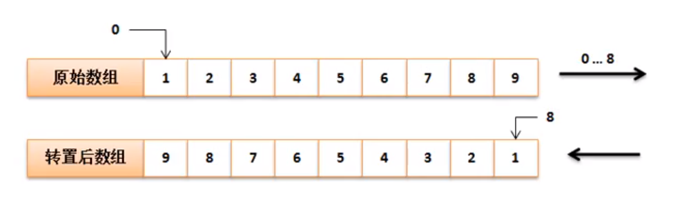
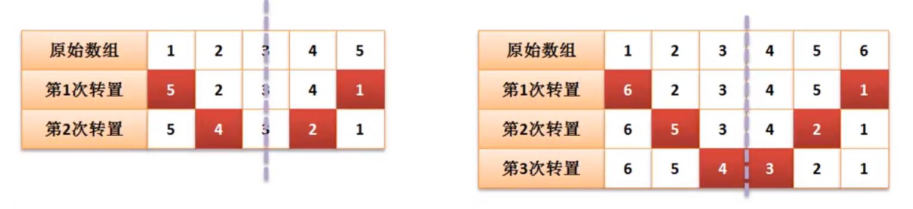

# 数组排序案例分析2
1. 以下是数组倒置第一种做法：


```
class ArrayUtil
{
	public static void printlnArray (int[] array)
	{
		for(int item:array)
		{
			System.out.println(item);
		}
	}
}

public class JavaDemo
{
	public static void main (String[] args)
	{
		int[] data = new int[] {1,2,3,4,5,6,7,8,9} ; 
		int[] temp = new int[data.length];
		int foot = temp.length - 1;
		
		for(int i =0 ;i <data.length ; i++)
		{
			temp[foot--] = data[i] ; // 转置
		}
		data = temp ;
		ArrayUtil.printlnArray(data); // 9 8 7 6 5 4 3 2 1
	}

	
}
```
以下是内存分析：


---

2. 以下方式在本数组中进行置换，不会产生垃圾，但时间复杂度比第一种大：

```
class ArrayUtil
{
	public static void reverse(int[] data)
	{
		int center = data.length / 2 ;
		int head = 0 ;					// 操作脚标
		int tail = data.length -1 ; // 操作脚标

		for(int i =0 ;i < center ; i++)
		{
			int temp = data[head] ;	// 头部存储
			data [head] = data[tail] ; // 末尾放置头部
			data [tail] = temp ;			//	头部放置尾部
			head++;							
			tail--;
		}
	}

	public static void printlnArray (int[] array)
	{
		for(int item:array)
		{
			System.out.println(item);
		}
	}
}

public class JavaDemo
{
	public static void main (String[] args)
	{
		int[] data = new int[] {1,2,3,4,5,6,7,8,9} ; 
		
		ArrayUtil.reverse(data);
		ArrayUtil.printlnArray(data); // 9 8 7 6 5 4 3 2 1
	}

	
}
```
