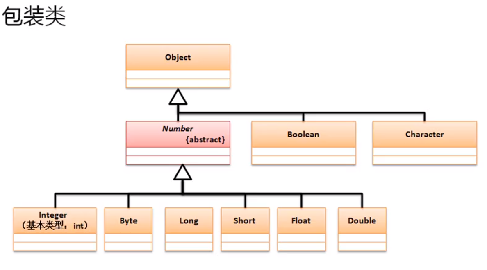

# 包装类实现原理分析
1. 包装类的主要功能是针对于基本的数据类型的对象转换而实现的
2. Object类最大的特点是所以类的父类，并且可以接收所有的数据类型，但是在这个过程中存在有一个问题，基本数据类型并不是一个类，所以要想将基本数据类型以类的形式处理，那么就需要对其进行包装
3. 以int数据类型为例，实现一个包装处理的定义：

```
class Int
{
	private int data ;
	public Int (int data)
	{
		this.data = data ;
	}

	public int IntValue()
	{
		return this.data ;
	}
}

public class JavaDemo
{
	public static void main(String[] args)
	{
		Object obj = new Int(10) ;   // 装箱：将基本数据类型保存在包装类之中
		int x = ((Int)obj).IntValue() ; //  拆箱：从包装类中获取基本数据类型
		System.out.println(x) ;		     // 10
	}
}
```
3. 基本数据类型进行包装处理后可以像对象一样进行引用传递，同时也可以使用Object类进行接收，但是我们可以发现基本数据类型与Object类型之间的缺陷，JDK也早就发现了同样的问题
4. 基本数据类型有8种，所以有8种包装类，包装类的定义结构如下：

5. 在Java中的包装类一共有2种类型：
    - 对象型包装类（Object直接子类）：Boolean、Character
    - 数值型包装类：Byte、Short、Integer、Long、Folat、Double
6. Number类下的方法：
    - public short shortValue()，从包装类中获取short数据
    - public byte byteValue()，从包装类中获取byte数据
    - public abstract double doubleValue()，从包装类中获取double数据
    - public abstract float floatValue()，从包装类中获取float数据
    - public abstract int intValue()，从包装类中获取int数据
    - public abstract long longValue()，从包装类中获取long数据
