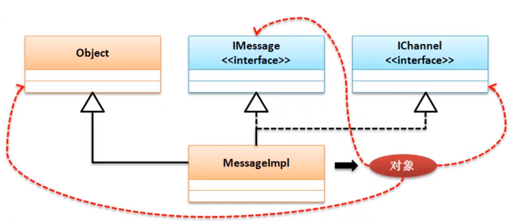

# 接口基本定义
1. 抽象类与普通类相比最大的优势在于，可以实现对子类覆写方法的控制，但是在抽象类中可能会保留有一些普通方法，而普通方法里可能会涉及到一些安全或者隐私的操作问题，如果要想在外部隐藏全部的实现细节，则可以通过接口来描述
2. 在JDK1.8引入了lambda表达式，接口也发生了一些改变，但是接口的组成当中还是以抽象方法和全局常量为主
3. 在Java之中使用的是**interface**关键字进行定义：

```
interface IMessage
{
	public static final String INFO = "www.baidu.com" ; // 全局常量

	public abstract String getInfo () ;
}
```
4. 接口的使用原则：
    - 接口需要被子类实现（**implements**），一个子类可以实现多个父接口
    - 子类（如果不是抽象类）那么一定要覆写接口之中的全部抽象方法
    - 接口对象可以利用子类对象向上转型进行实例化
5. 定义接口子类：

```
interface IMessage
{
	public static final String INFO = "www.baidu.com" ; // 全局常量

	public abstract String getInfo () ;
}

class MessageImpl	implements IMessage // 实现接口
{
	public String getInfo() 
	{
		return "得到一个信息" ;
	}
}

public class JavaDemo
{
	public static void main(String[] args)
	{
		IMessage msg = new MessageImpl() ;
	 	System.out.println ( msg.getInfo() ); // 得到一个信息
		System.out.println ( IMessage.INFO ); // www.baidu.com
	}
}
```
6. 在Java里面之所以使用接口主要目的是一个子类可以实现多个接口，利用接口可以实现多继承：

```
interface IMessage
{
	public static final String INFO = "www.baidu.com" ; // 全局常量

	public abstract String getInfo () ;
}

interface IChannel
{
	public abstract boolean connect() ;
}

class MessageImpl	implements IMessage,IChannel // 实现接口
{
	public String getInfo() 
	{
		if(this.connect())
			return "得到一个信息" ;
		else return "通道创建失败，消息无法获取" ;
	}

	public boolean connect()
	{
		System.out.println("消息发送通道已经成功建立") ;
		return true ;
	}
}

public class JavaDemo
{
	public static void main(String[] args)
	{
		IMessage msg = new MessageImpl() ;
	 	System.out.println ( msg.getInfo() ); // 消息发送通道已经成功建立--->得到一个信息
		System.out.println ( IMessage.INFO ); // www.baidu.com
	}
}
```
7. 此时MessageImpl对象可以任意的实现父接口转换：


```
public class JavaDemo
{
	public static void main(String[] args)
	{
		IMessage msg = new MessageImpl() ;
		IChannel chl = msg ;
	 	System.out.println ( chl.connect() ); 
	}
}
```

由于**MessageImpl**子类实现了IMessage,IChannel这两个接口，所以这个子类可以是这两个接口任意一个接口的实例，那么就说明这两个接口实例直接是可以转换的

8. 在Java中接口是不允许去继承父类的，所以接口不会是Object的子类，但是根据之前的分析发现MessageImpl是Object的子类，所以Object可以接收到接口，观察Object与接口的转换：

```
public class JavaDemo
{
	public static void main(String[] args)
	{
		Object obj = new MessageImpl() ;
		IChannel chl = ( IChannel ) obj ;
	 	System.out.println ( chl.connect() ); 
	}
}
```
9. Object类对象可以接收所有数据类型，包括基本数据类型、类对象、接口对象、数组
10. 由于接口描述的是一个公共的定义标准，所以在接口之中的所有抽象方法的访问权限都为public，接口虽然已经可以成功的进行了定义，但是不要忽略在实际的开发的过程中，实现接口的有可能是抽象类，一个抽象类可以实现多个接口，一个普通类只能继承一个抽象类并且可以是实现多个父接口，但是要先继承后实现：

```
interface IMessage
{
	public static final String INFO = "www.baidu.com" ; // 全局常量

	public abstract String getInfo () ;
}

interface IChannel
{
	public abstract boolean connect() ;
}

abstract class DatabaseAbstract  
{
	public abstract boolean getDatabaseConnection() ;
}

class MessageImpl	extends DatabaseAbstract implements IMessage,IChannel // 实现接口
{
	public String getInfo() 
	{
		if(this.getDatabaseConnection())
			return "得到一个数据库信息" ;
		else return "数据库无法访问" ;
	}

	public boolean getDatabaseConnection() 
	{
		System.out.println("数据通道已经成功建立") ;
		return true ;
	}

	public boolean connect()
	{
		System.out.println("消息发送通道已经成功建立") ;
		return true ;
	}
}

public class JavaDemo
{
	public static void main(String[] args)
	{
		IMessage imsg = new MessageImpl() ;
	 	System.out.println ( imsg.getInfo() ); // 数据通道已经成功建立--->得到一个数据库信息
	}
}
```
10. 虽然一个接口无法去继承一个父类，但是一个接口可以extends继承若干个父接口，也就是所谓的接口多继承

```
interface IMessage
{
	public abstract String getInfo () ;
}

interface IChannel
{
	public abstract boolean connect() ;
}

interface IService extends IMessage,IChannel
{
	public  String service() ;
}

class MessageService implements	IService
{
	public String getInfo() 
	{
		return "得到了一个信息" ;
	}

	public boolean connect() 
	{
		return true ;
	}

	public String service()		
	{
		return "获取消息服务" ;
	}
}

public class JavaDemo
{
	public static void main(String[] args)
	{
		MessageService msg = new MessageService() ;
		System.out.println ( msg.service() );
	 	System.out.println ( msg.getInfo() ); // 消息服务--->得到了一个信息
	}
}
```
11. 在实际开发之中，接口的使用往往有三种形式：
    - 进行标准设置
    - 表示一种操作的能力
    - 暴露远程方法试图，一般在RPC分布式开发中使用

