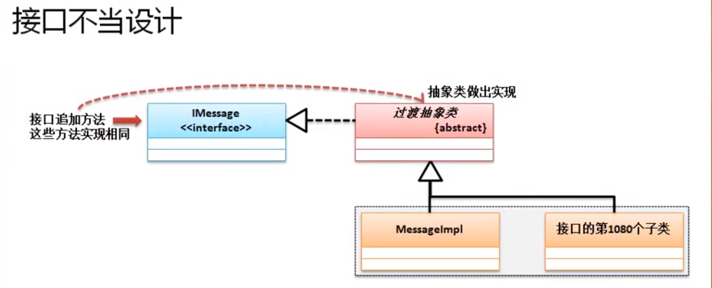

# 接口定义加强

观察上图我们可以发现，如果接口一但改变，那么所有的实现该接口的子类全部都要修改，显然这是一个很头疼的问题，为了解决这种问题，一般我们有2种方式解决：
1. 在接口当中定义普通方法（JDK1.8）：
```
interface IMessage
{
	public abstract String message () ;
	public default boolean connect () // 接口里定义普通方法
	{
		System.out.println("建立消息的发送通道") ;
		return true ;
	}
}
class Message implements IMessage
{
	public String message() 
	{
		return "得到一个信息" ;
	}
}	

public class JavaDemo
{
	public static void main(String[] args)
	{
		IMessage msg = new Message() ;
		if(msg.connect())
		{
			System.out.println ( msg.message() );
		}
	
	}
}
```
2. 使用抽象类实现接口的方法，而后再由子类继承抽象类：

```
interface IMessage
{
	public abstract String message () ;
	public abstract boolean connect () ;
}

abstract class AbstractMessage implements IMessage
{
	public  boolean connect () // 接口里定义普通方法
	{
		System.out.println("建立消息的发送通道") ;
		return true ;
	}
}

class Message extends AbstractMessage
{
	public String message() 
	{
		return "得到一个信息" ;
	}
}	

public class JavaDemo
{
	public static void main(String[] args)
	{
		AbstractMessage msg = new Message() ;
		System.out.println( msg.connect() ) ;
		System.out.println( msg.message() ) ;
	}
}
```

